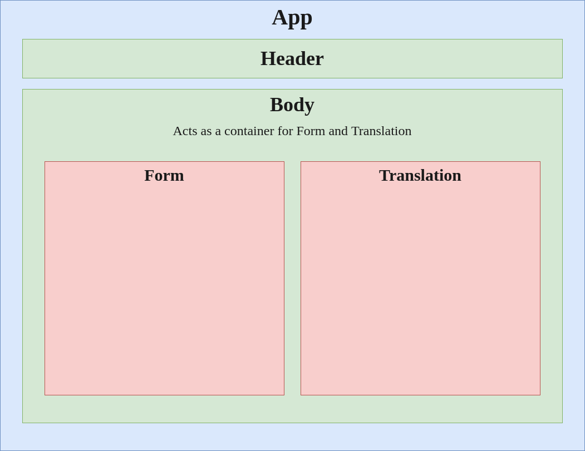
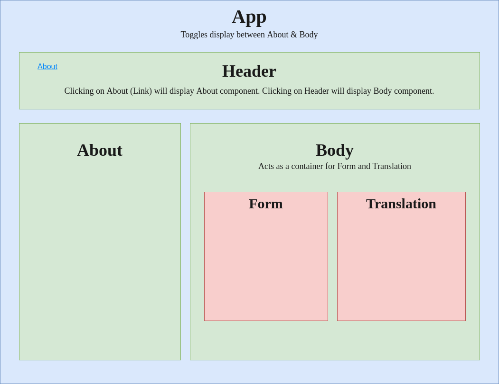
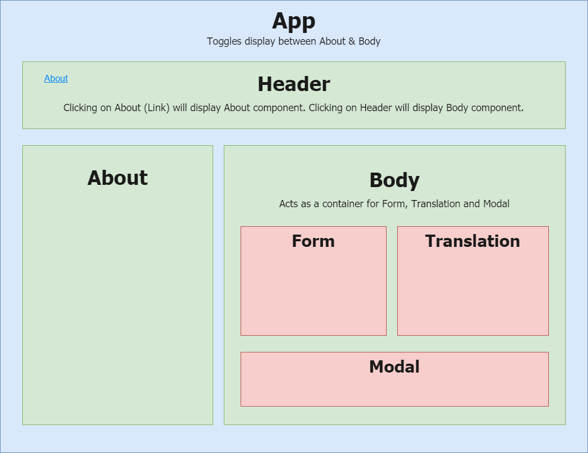
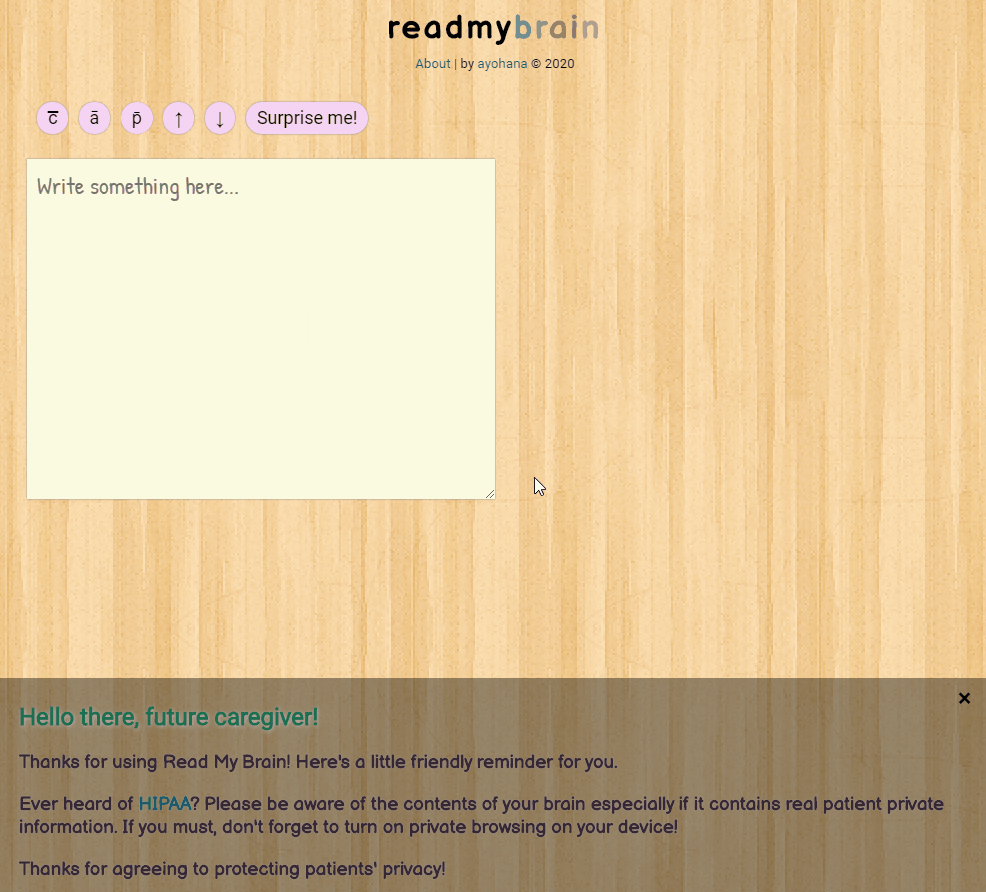
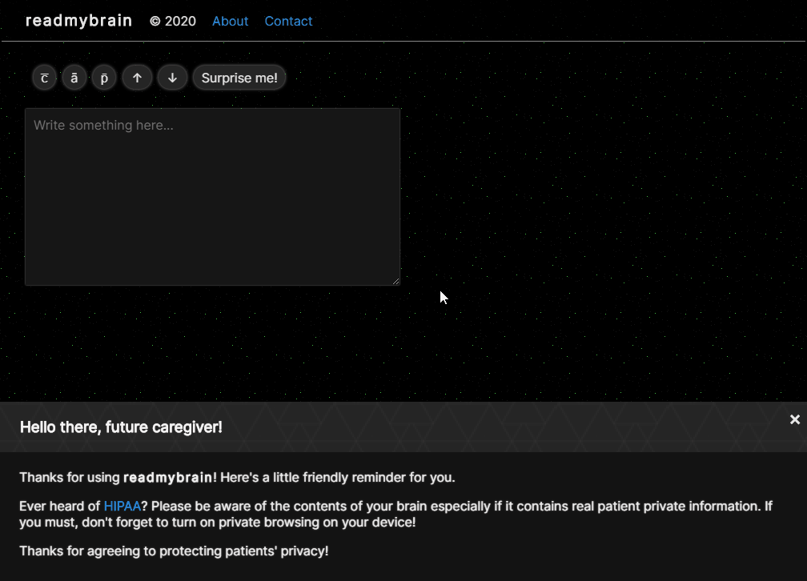
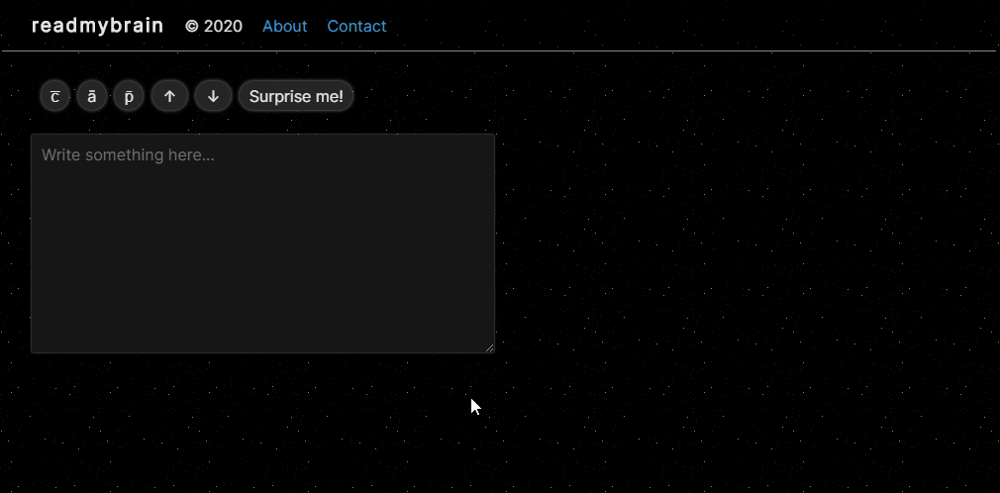
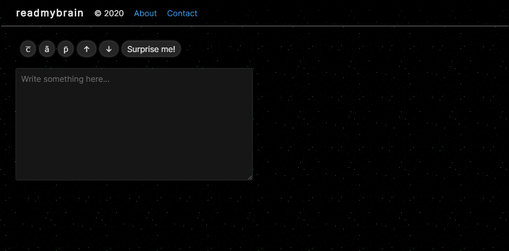
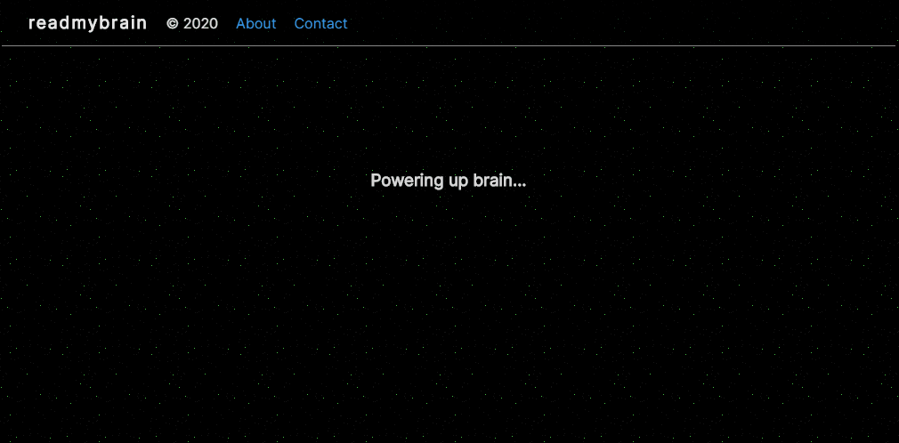
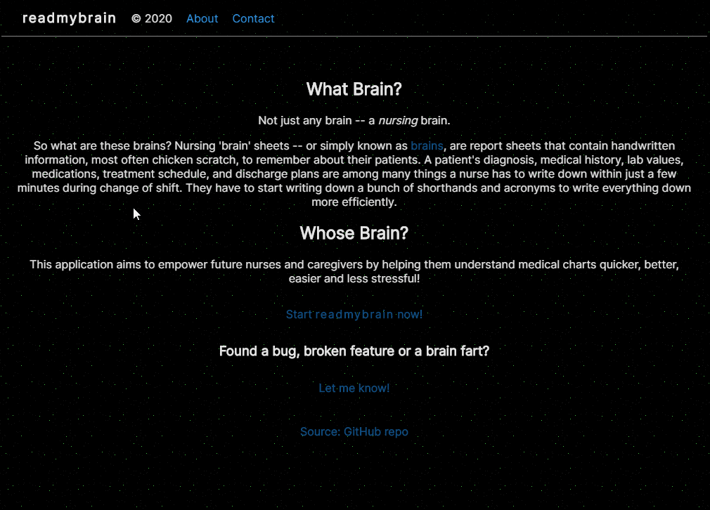

<div align=center>

# [Read My Brain](https://github.com/ayohana/read-my-brain.git/)

#### Capstone Project for [Epicodus](https://www.epicodus.com/), 05.15.2020 - 05.21.2020

#### By [**Adela Darmansyah**](https://github.com/ayohana/)

[About](#About) | [What Brain](##What-Brain) | [Whose Brain](#Whose-Brain) | [Minimum Viable Product](#Minimum-Viable-Product) | [Future Product Roadmap](#Future-Product-Roadmap)

[Bugs](#Known-Bugs) | [Installation Instructions](#Installation-Instructions) | [Screenshots](#Screenshots)  | [Technologies](#Technologies) | [Resources](#Resources) | [Contact and Support](#Contact-and-Support) | [License](#License)

   

</div>

## About

**A web application that uses [Read My Brain API](https://github.com/ayohana/read-my-brain-api.git/) for translating indecipherable nursing brain jargons into simple, readable text.**

## What Brain

For this project, I will be referring to nursing 'brain' sheets--or in the nursing world, simply known as _brains_. So what are these brains? **Nursing brains** are report sheets that contain handwritten information (most often chicken scratch) to remember about their patients. In a typical shift change routine in a hospital, a nurse only has 20 minutes to receive verbal report from the previous nurse and write down everything they need to know about all five patients assigned to them. Details on their diagnosis, medical history, current symptoms, lab values, medication administration times, treatment schedule, discharge plan, their preference of filling up a water pitcher with three quarters ice and a quarter water with two straws are among many things nurses have to write down for each patient within a few minutes. Nurses and other healthcare providers have to start using a whole lot of acronyms to write things down efficiently. Here's an example:

> `````
> 84F DNR pt from ED is A&Ox2
> c̅ Hx HTN, DM, RTKA & Ax pnc
> will need CXR STAT.
> `````

**Read My Brain** will translate this into layman's terms:

> `````
> 84 year old female Do Not Resuscitate patient from Emergency Department is alert and oriented x2
> with history of hypertension, diabetes mellitus, right total knee arthroplasty and allergy to penicillin
> will need chest x-ray immediately.
> `````

## Whose Brain

Users are primarily going to be **future health providers**, including nursing students and new nurses. Inspired by my own nursing experience, listed below are my **goals** for this project:
1. To help future caregivers understand medical charts quicker, better, easier and make their learning less stressful.
2. To enable nursing students and new nurses keep up with their preceptors' brains.
3. To empower future nurses via Read My Brain.

## Minimum Viable Product

<details>
  <summary>Expand to see completed MVP goals!</summary>

  - [x] Design the database structure using Draw.io.
  - [x] Build a back-end API using C#/.NET Core and MySQL with READ functionality.
      - [x] Read a sentence by sending the sentence as a query parameter and the API will return the translated sentence.
  - [x] Design a component diagram for the front end using Draw.io.
  - [x] Build a front-end JavaScript/React application that allows users to enter a sentence and display the translated sentence.
      - [x] The default view will be a form with a single text box and a submit functionality.
      - [x] The user will be able to enter a sentence into the text box and submit it.
      - [x] There will be a maximum number of 50 characters in a sentence.
      - [x] Upon submission, the application will call the API to read the sentence.
      - [x] The application will display the returned API response as a string.

<div align=center>

  #### MVP React Component Diagram



</div>

</details>

## Future Product Roadmap

<details>
  <summary>See stretch goals under construction!</summary>

  - [x] Build a back-end API using C#/.NET Core and MySQL with full CRUD functionality.
      - [x] Create a new term and its abbreviation into the API's database.
      - [x] Read a sentence by sending the sentence as a query parameter and the API will return the translated sentence.
      - [x] Update details of an term.
      - [x] Delete an term.
  - [x] Enable querying special characters. For instance, c̅ for with, ā for before and p̄ for after.
  - [x] Deploy API's database via Azure.
  - [x] Deploy the back-end API via Azure.
  - [x] Deploy the front-end application via Firebase/Netlify.
  - [x] Users can enter longer sentences (max 200 characters per sentence).
  - [x] Users can enter a paragraph (max 1000 characters).
  - [x] There's an unlimited number of characters a user can enter.
  - [x] The API can translate live/real-time.
  - [x] Users can copy special characters and insert them into their input text. For instance, icons c̅ for with, ā for before and p̄ for after.
  - [x] Use custom CSS styling instead of styling libraries.
  - [x] Refactor `<input>` to `<textarea>` to enable resizing the text box.
  - [x] Display message for successfully copying icons.
  - [x] Add CSS animation to display "copied" message.
  - [x] Users can copy the translated result ~~with a click of a button~~by clicking the translated text.
  - [x] Add functionality to generate random sentences in the front end so that users can test/use the app right away.
  - [x] Refactor API call method in the front end to only call the API as needed (per word instead of per letter typed). In other words, trigger the API call when a user presses spacebar or enter.
  - [x] Refactor React component diagram.
      - [x] Add an "About" section to the front end.
      - [x] Add a link to my GitHub repo.
      - [x] Warn users to be careful when translating real patient or personal identity information to prevent violating their privacy (HIPAA).
  - [x] Application offers dark mode.
  - [ ] Insert special characters automatically to input text area on clicking them.
  - [ ] Create an API key for users.
  - [ ] Users can add new terms via the front-end application for open contribution. However, users will need an API key in order to do this.
  - [ ] Users can update existing terms via the front-end application.
  - [ ] Count the number of app usage (count every time a translation occurs).
  - [ ] Configure Azure/back end CORS settings to only allow Read My Brain (one application) to access it.
  - [ ] Share the application by posting in a nursing forum.
  - [ ] Application offers light mode.
  - [ ] Add a blinking text cursor to text editor.
  - [ ] Use Redux in case the application's scale of state gets very large.
  - [ ] Apply Swagger API or add Views to API for http routes documentation.
  - [ ] The API can translate the vice versa (from layman’s terms to nursing jargons).
  - [ ] Make the front end media responsive.
  - [ ] Add functionality to enable uploading a document and the app will translate the whole document.
  - [x] ~~Use a React UI library such as React Semantic UI or Material UI.~~
  - [x] ~~Use Quill's basic text editor for application UI.~~
  - [x] ~~Apply Quill's toolbar.~~
  - [x] ~~Modify Quill's toolbar by adding an option to insert special characters into user input. For instance, c̅ for with, ā for before and p̄ for after.~~

  _Note: Quill does not have an event listener that will help with the live translation feature therefore stretch goals were refactored._

<div align=center>

  #### Refactored React Component Diagram (1st version)



  #### Refactored React Component Diagram (2nd version)



  #### Initial Prototype:



</div>

</details>

## Known Bugs

No known bugs at this time.

## Installation Instructions

### For Local Development

* Clone this [repository](https://github.com/ayohana/read-my-brain.git/)
* Open the `Command Line Interface` and enter the following:
  * `cd read-my-brain` to navigate into the repository.
  * `npm install` to install all necessary plug-ins.
  * `npm start` to start the application.
  
_Note: Unfortunately, the deployed app has been shut down due to expired free Azure membership. Please see screenshots below for a preview of the app! Thanks for visiting!_

## Screenshots

<div align=center>

  #### About Page



  #### Reading a Brain



  #### Copy Translation



  #### Loading Screen



  #### Dismiss Privacy Agreement Modal



</div>

## Technologies

### Front End

* [Read My Brain API](https://github.com/ayohana/read-my-brain-api.git/)
* HTML
* CSS
* JavaScript
* Markdown
* [React](https://reactjs.org/)
* [Draw.io](https://app.diagrams.net/)
* [Google Fonts](https://fonts.google.com/)
* [React Copy To Clipboard API](https://www.npmjs.com/package/react-copy-to-clipboard)
* _npm*_

_*Open `package.json` file to see the complete list of all node modules._

### Back End API

* C#
* [.NET Core](https://dotnet.microsoft.com/download/dotnet-core/) (Windows OS)
* [MySQL](https://dev.mysql.com/downloads/file/?id=484919) (Windows OS)
* [EF Core](https://github.com/PomeloFoundation/Pomelo.EntityFrameworkCore.MySql)
* [Postman](https://www.postman.com/downloads/)
* [Azure App Service](https://azure.microsoft.com/en-us/services/app-service/)
* [Draw.io](https://app.diagrams.net/)

## Resources

* [My Capstone Project Proposal](https://docs.google.com/document/d/1bxW7XzQk9xxoDU-CSc2oWtsvJcJJNuBybUBFhglaJDo/edit?usp=sharing)
* [Read My Brain API](https://github.com/ayohana/read-my-brain-api.git/)

### Front End

* [Read My Brain API](https://github.com/ayohana/read-my-brain-api.git/)
* [AJAX and APIs in React](https://reactjs.org/docs/faq-ajax.html)
* [Using the State Hook](https://reactjs.org/docs/hooks-state.html)
* [Using the Effect Hook](https://reactjs.org/docs/hooks-effect.html)
* HTML & CSS
    * [HTML oninput Event](https://www.w3schools.com/jsref/event_oninput.asp)
    * [HTML onkeyup Event](https://www.w3schools.com/jsref/event_onkeyup.asp)
    * [HTML onmouseup Event](https://www.w3schools.com/jsref/event_onmouseup.asp)
    * [HTML Clipboard Events](https://www.w3schools.com/jsref/obj_clipboardevent.asp)
    * [Discussion: `<i>` vs `<span>` HTML tags for icons](https://stackoverflow.com/questions/11135261/should-i-use-i-tag-for-icons-instead-of-span)
    * [CSS-Tricks: Textarea Tricks](https://css-tricks.com/textarea-tricks/)
    * [Generic Anatomy Colors](https://www.slicer.org/wiki/Slicer3:2010_GenericAnatomyColors)
* [Copy-to-clipboard React component](https://github.com/nkbt/react-copy-to-clipboard)
* [Parks in Redux](https://github.com/ayohana/parks-redux.git) - a successful test project for deploying React app using Netlify
* [CSS @keyframes Rule](https://www.w3schools.com/cssref/css3_pr_animation-keyframes.asp)
* [CSS Animation Speed](https://www.w3schools.com/css/tryit.asp?filename=trycss3_animation_speed)
* [Subtle Background Patterns](https://www.toptal.com/designers/subtlepatterns/)
* [CSS Navigation Bar](https://www.w3schools.com/css/tryit.asp?filename=trycss_navbar_horizontal)
* [9 tips to quickly improve your UI designs](https://uxdesign.cc/9-simple-tips-to-improve-your-ui-designs-fast-377c5113ac82)
* [8 Tips for Dark Theme Design](https://uxplanet.org/8-tips-for-dark-theme-design-8dfc2f8f7ab6)
* [7 Practical Tips for Cheating at Design](https://medium.com/refactoring-ui/7-practical-tips-for-cheating-at-design-40c736799886)

### Back End API

* [Tutorial: Build an ASP.NET Core and SQL Database app in Azure App Service on Windows](https://docs.microsoft.com/en-us/azure/app-service/app-service-web-tutorial-dotnetcore-sqldb)
  * [Tenant API](https://github.com/ayohana/TenantAPI.git) - a successful test project for deploying SQL database and .NET app using Azure App Service
  * [Azure Tools for Visual Studio Code](https://marketplace.visualstudio.com/items?itemName=ms-vscode.vscode-node-azure-pack)
  * [Azure CLI on Windows](https://docs.microsoft.com/en-us/cli/azure/install-azure-cli-windows?view=azure-cli-latest#install-or-update)
* [Tutorial: Building an API](https://www.learnhowtoprogram.com/c-and-net/building-an-api)
* [Queries in LINQ to Entities: Method-Based Query Syntax](https://docs.microsoft.com/en-us/dotnet/framework/data/adonet/ef/language-reference/queries-in-linq-to-entities#method-based-query-syntax)
* [Strings in C# - Microsoft Documentation](https://docs.microsoft.com/en-us/dotnet/csharp/programming-guide/strings/)

## Contact and Support

Found a bug, broken feature or a brain fart? Let me know!

[adela.yohana@gmail.com](mailto:adela.yohana@gmail.com)

## License

This application is licensed under the MIT license.

Copyright (c) 2020 **Adela Darmansyah**
